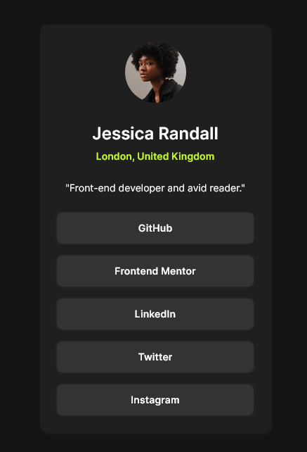

# Frontend Mentor - Social links profile solution

This is a solution to the [Social links profile challenge on Frontend Mentor](https://www.frontendmentor.io/challenges/social-links-profile-UG32l9m6dQ). Frontend Mentor challenges help you improve your coding skills by building realistic projects.

## Overview

### The challenge

Users should be able to:

- See hover and focus states for all interactive elements on the page

### Screenshots

### Links

- Solution URL: [gh repo](https://github.com/ha308ing/fm_social-links-profile)
- Live Site URL: [gh pages deployment](https://ha308ing.github.io/fm_social-links-profile)

### PixelGlass Alignment

Uncomment `PixelGlass` in the `main.tsx`, then align background with `html` padding or `background-position`
